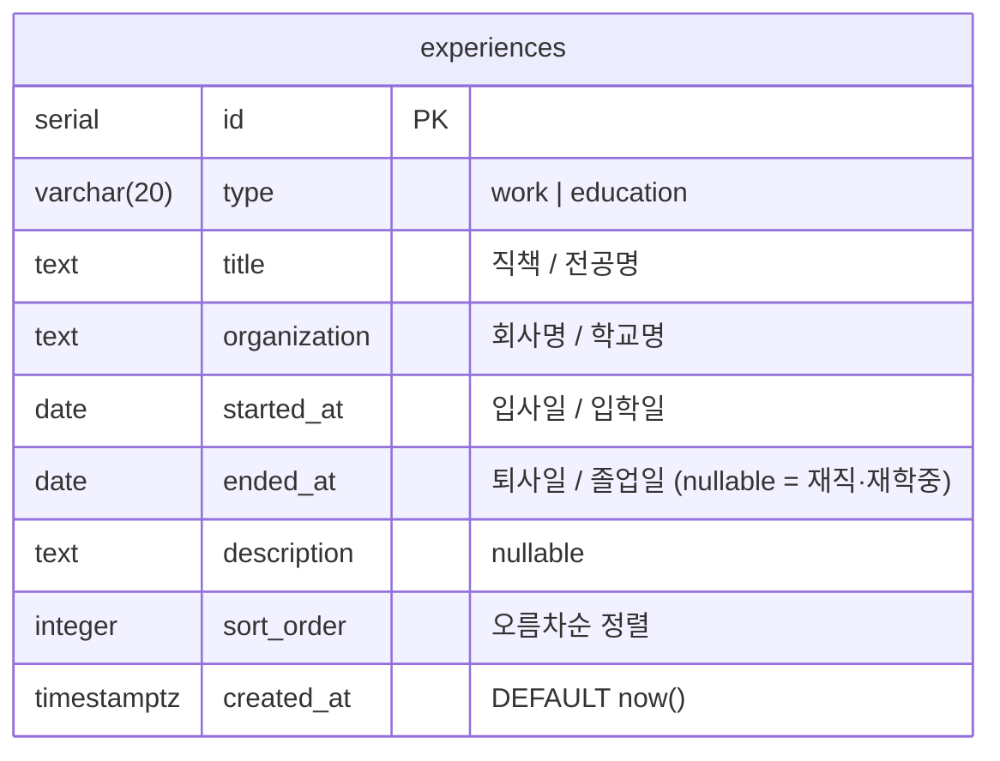

# Database Schema

포트폴리오 사이트 DB 스키마. Supabase (PostgreSQL) + Drizzle ORM 사용.

## ERD

## 테이블 설명

### experiences

경력·학력 타임라인 데이터.

| 컬럼 | 타입 | 설명 |
|------|------|------|
| id | serial PK | 자동 증가 |
| type | varchar(20) | `work` 또는 `education` |
| title | text | 직책 / 전공명 |
| organization | text | 회사명 / 학교명 |
| started_at | date | 입사일 / 입학일 (YYYY-MM-DD) |
| ended_at | date | 퇴사일 / 졸업일. `null`이면 재직·재학 중 |
| description | text | 상세 설명 (선택) |
| sort_order | integer | 타임라인 표시 순서 (오름차순) |
| created_at | timestamptz | 생성 시각 |

## 파일 위치

- 스키마 정의: `src/db/schema.ts`
- DB 클라이언트: `src/db/index.ts`
- Drizzle 설정: `drizzle.config.ts`
